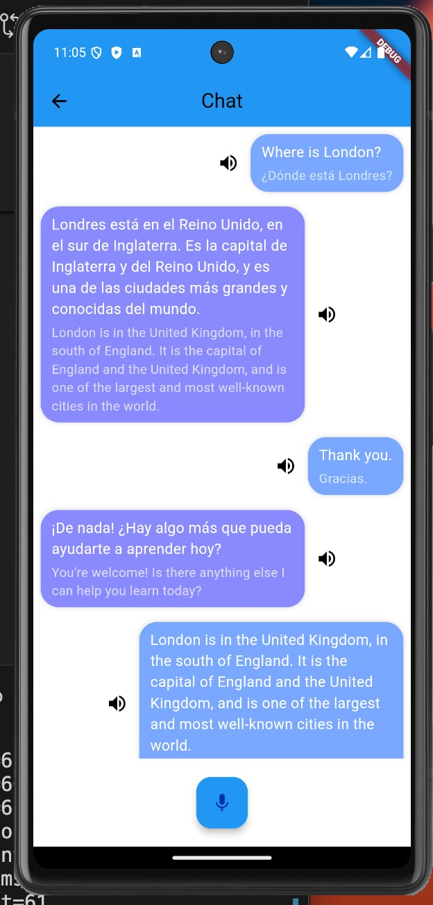

# TalkApp
This is a flutter android app created as a project for the Intro to Flutter class. It consists of a frontend chat app built with flutter and a backend built with dart. The purpose of the app is to practice conversing in a foreign language.

To create the backend we utilized various openai technologies such as ChatGPT, TTS and whisper, dart and alfred for the code as well as googles GCP for hosting and audio storage.

### mockup

[figma mockup](https://www.figma.com/design/fYEbsNArHXvlWg8LGrmxHu/App-Mockup?node-id=0-1&t=w57Vp6wrly7ACVMv-1)

### photo of app:

